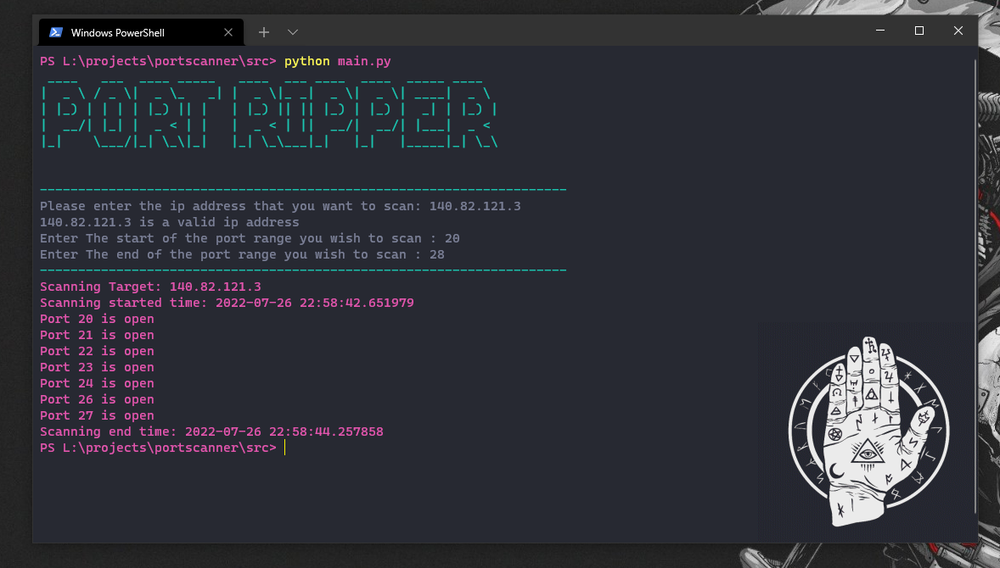

# Port Ripper

A simple command-line port scanner.

## Usage

"python main.py IP SP EP"

Where IP is the ip adddress of the host you wish to scan, SP is the starting port range, EP is the ending port range.

example:

"python main.py 140.82.121.3 20 42"
